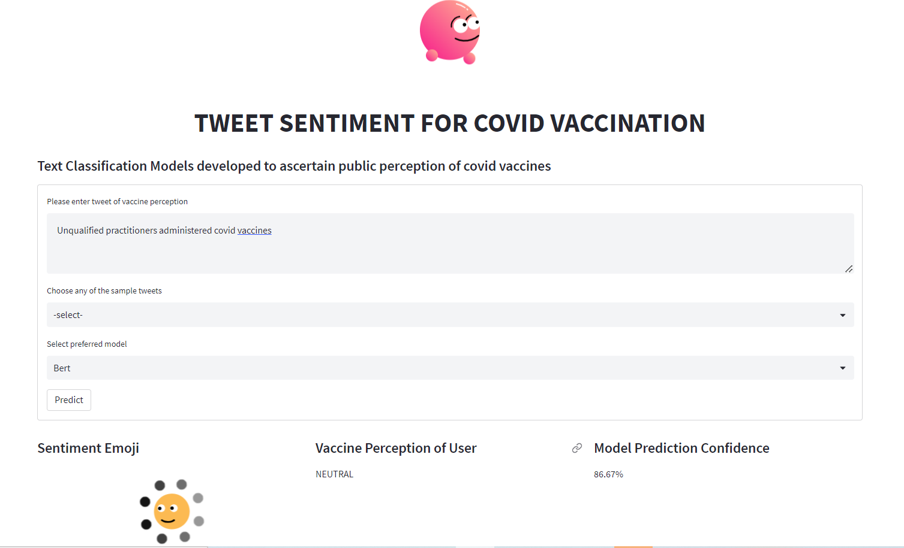

# PROJECT: Natural Language Processing - SENTIMENT ANALYSIS USING HUGGING FACE

## Description 
In this project, I finetune a pre-trained machine learning model to assess if a Twitter post related to vaccinations is positive, neutral, or negative. This solution could help governments and other public health actors monitor public sentiment towards COVID-19 vaccinations and help improve public health policy, vaccine communication strategies, and vaccination programs across the world.

This project serves as an introduction to Unstructured data exploitation, especially Natural Language Processing data, using Machine Learning..

The fine-tuned machine learning model will be used to used to create a Streamlit App that will be hosted on Hugging Face.

| Code      | Name        | Published Article |  Deployed App |
|-----------|-------------|:-------------|:------|
| LP 5     | The Sentiment Analysis Project - Natural Language Processing| [Medium](https://medium.com/@el.darkoel/natural-language-processing-tweet-sentiment-analysis-e2421896783d) LinkedIn| [Streamlit App - Hugging Face](https://huggingface.co/spaces/elvis-d/Tweet-Sentiment-Analysis-App.STREAMLIT) |

## Screenshot of App Deployed on Hugging Face

## Note on Data
The data comes from tweets collected and classified through Crowdbreaks.org [Muller, Martin M., and Marcel Salathe. "Crowdbreaks: Tracking Health Trends Using Public Social Media Data and Crowdsourcing." Frontiers in public health 7 (2019).]. Tweets have been classified as pro-vaccine (1), neutral (0) or anti-vaccine (-1). The tweets have had usernames and web addresses removed.

The objective of this project is to develop a machine learning model and build a GUI App to assess if a twitter post that is related to vaccinations is positive, neutral, or negative.

**Variable definition:**

**tweet_id:** Unique identifier of the tweet

**safe_tweet:** Text contained in the tweet. Some sensitive information has been removed like usernames and urls

**label:** Sentiment of the tweet (-1 for negative, 0 for neutral, 1 for positive)

**agreement:** The tweets were labeled by three people. Agreement indicates the percentage of the three reviewers that agreed on the given label. You may use this column in your training, but agreement data will not be shared for the test set.

Data files available are:

**Train.csv** - Labelled tweets on which to train your model

**Test.csv** - Tweets that you must classify using your trained model

## Setup
Install the required packages to be able to run the evaluation locally.

You need to have [`Python3`](https://www.python.org/) on your system. Then you can clone this repo and being at the repo's root (`root :: repo_name> ...`)  follow the steps below:

- Windows:
        
        python -m venv venv; venv\Scripts\activate; python -m pip install -q --upgrade pip; python -m pip install -qr requirements.txt  

- Linux & MacOs:
        
        python3 -m venv venv; source venv/bin/activate; python -m pip install -q --upgrade pip; python -m pip install -qr requirements.txt  

The both long command-lines have a same structure, they pipe multiple commands using the symbol **;** but you may manually execute them one after another.

1. **Create the Python's virtual environment** that isolates the required libraries of the project to avoid conflicts;
2. **Activate the Python's virtual environment** so that the Python kernel & libraries will be those of the isolated environment;
3. **Upgrade Pip, the installed libraries/packages manager** to have the up-to-date version that will work correctly;
4. **Install the required libraries/packages** listed in the `requirements.txt` file so that it will be allow to import them into the python's scripts and notebooks without any issue.

**NB:** For MacOs users, please install `Xcode` if you have an issue.

## Resources
1. [Quick intro to NLP](https://www.youtube.com/watch?v=CMrHM8a3hqw)
1. [Getting Started With Hugging Face in 15 Minutes](https://www.youtube.com/watch?v=QEaBAZQCtwE)
1. [Fine-tuning a Neural Network explained](https://www.youtube.com/watch?v=5T-iXNNiwIs)
1. [Fine-Tuning-DistilBert - Hugging Face Transformer for Poem Sentiment Prediction | NLP](https://www.youtube.com/watch?v=zcW2HouIIQg)
1. [Introduction to NLP: Playlist](https://www.youtube.com/playlist?list=PLM8wYQRetTxCCURc1zaoxo9pTsoov3ipY)
1. [Finetune Pre-trained Huggingface model](https://medium.com/mlearning-ai/fine-tuning-bert-for-tweets-classification-ft-hugging-face-8afebadd5dbf)
1. [Creating Gradio App](https://huggingface.co/course/chapter9/1)
1. Upload your Hugging Face model (and pipeline), and Deploy your Gradio app on the HuggingFace platform. [Read more](https://huggingface.co/docs/hub/models-uploading)
1. Dockerize your Gradio app to get it ready to be deployed to any cloud hub. [Watch this](https://www.youtube.com/watch?v=f6zJwK-pCJo)

## Evaluation
The evaluation metric for the fine-tuned pre-trained models is the **Root Mean Squared Error**.

The target can be any values between -1 and 1, inclusive.

## Author
Elvis Darko
